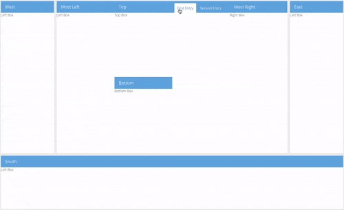

# ExtJS - DockingPanel

## Introduction
What does the DockingPanel do? Well, you maybe all know Visual Studio or IntelliJ. They all have one thing in common. You can customize their UI the way you want to. You can drag'n'drop certain views to other places. The ExtJs DockingPanel does the exact same thing. You can drag'n'drop panels to hbox'es or vbox'es or TabPanels.

## Why did we do this? Isn't this bad for Look and Feel?

In fact: NO. Not in our use case. We are building a large system with hundreds of different Layouts and View-Types, that are going to be displayed on an huge monitor. The user needs to have the freedom to customize the UI to perfectly fits their needs.

## How does it work

Because its possible to Dock into Border-Regions, and also within. There are three main classes. 

**DockContainer** handles the layouting for the Border-Layout. If you dont need the border layout thing, you dont need the DockContainer
**DockPanel** handles the layout generation for vbox, hbox or TabPanel
**DropPanel** handles the Dragging and Dropping and communicates with the **DockPanel** for layouting.

## Example
```
    xtype : 'dockcontainer',
    items : [
        {
            xtype : 'dockpanel',
            supportedRegions : ['center', 'north'], //Notice: This DockContainer only allows Region North and Center.
            region : 'north',
            height : 200,
            supportedDocks : ['center']
        },
        {
            xtype : 'dockpanel',
            region : 'center',
            height : 200,
            supportedDocks : ['center', 'top', 'left', 'right'], //Notice: This DockPanel does not allow to dock to bottom!
            items : [
                {
                    xtype: 'droppanel',
                    flex: 1,
                    html: 'Left Box',
                    layout: 'fit',
                    title : 'South'
                }
            ]
        }
    ]
````

## Contributing
The DockingPanel is at an very early stage. Its possible that its implementation is very unlikely to the Sencha "kind of things". But, if you're encounter some bugs or want some features. Feel free to contribute it to us :)

## Preview

